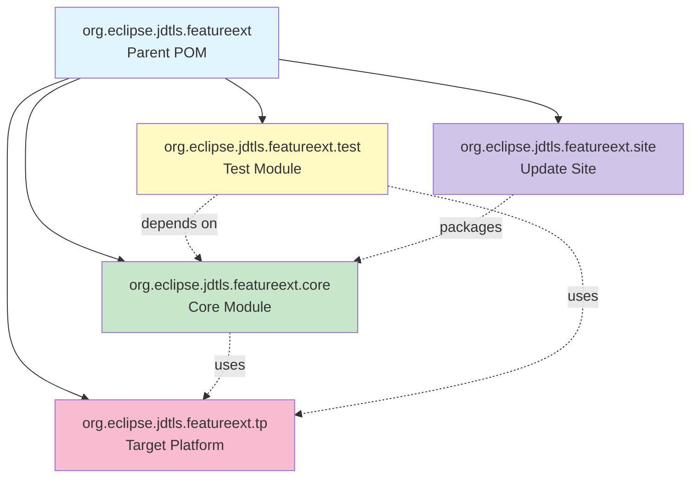
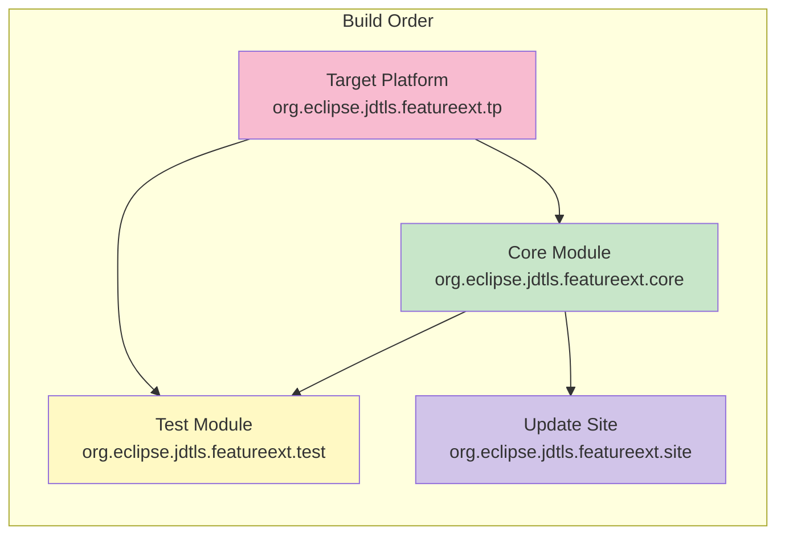
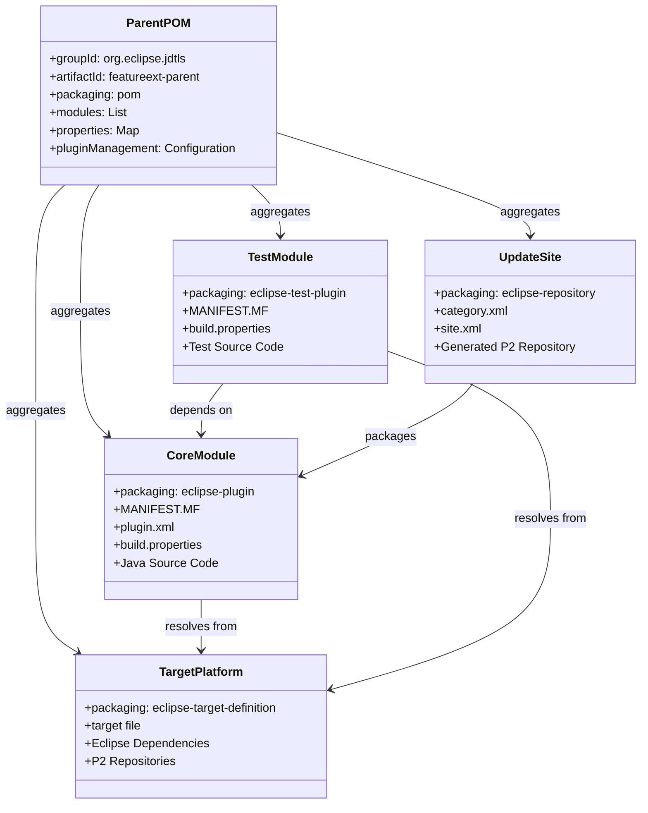
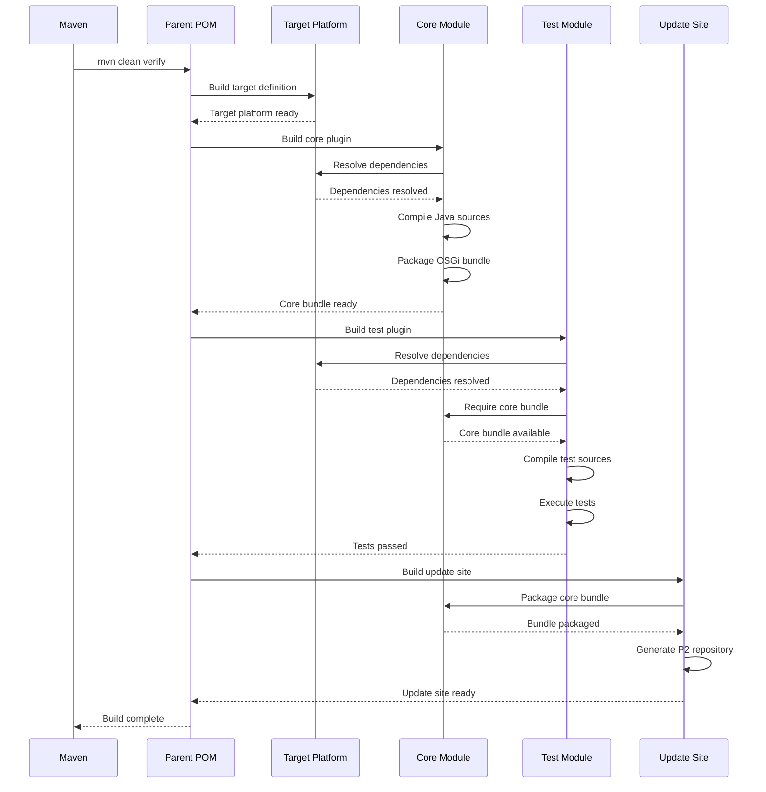
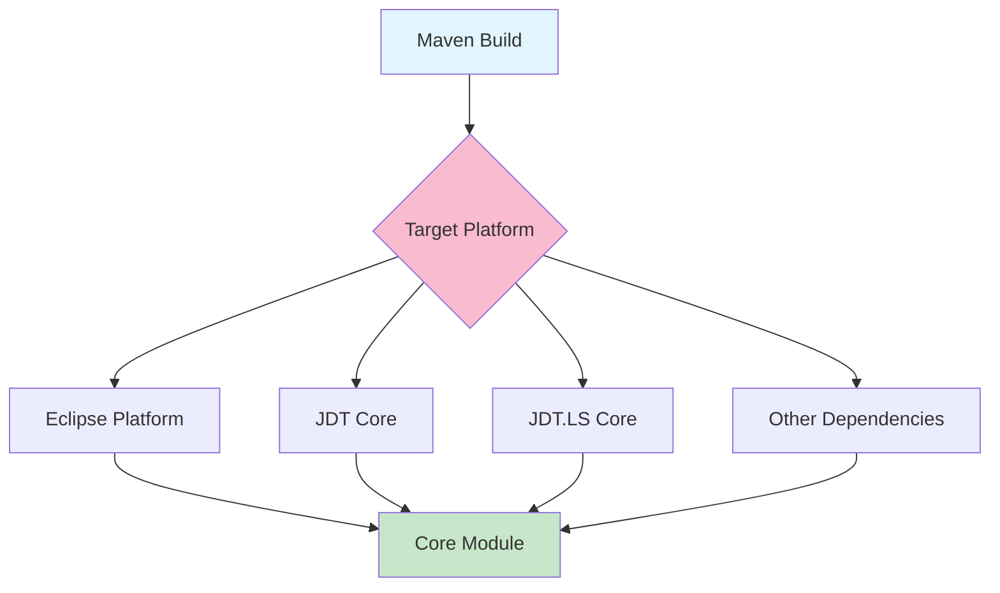

# Architecture Overview: org.eclipse.jdtls.featureext

## Project Structure Diagram



## Module Dependencies



## Component Relationships



## Build Flow



## File Structure Details

### Parent Module
```
org.eclipse.jdtls.featureext/
├── pom.xml                    # Parent POM with module aggregation
├── README.md                  # Project documentation
├── PLAN.md                    # Implementation plan
├── ARCHITECTURE.md            # This file
└── .gitignore                 # Git ignore patterns
```

### Core Module Structure
```
org.eclipse.jdtls.featureext.core/
├── pom.xml                    # Module POM (eclipse-plugin)
├── META-INF/
│   └── MANIFEST.MF            # OSGi bundle manifest
├── plugin.xml                 # Eclipse plugin extensions
├── build.properties           # Build configuration
├── src/
│   └── main/
│       └── java/
│           └── org/eclipse/jdtls/featureext/core/
│               ├── package-info.java
│               └── [implementation classes]
└── target/                    # Build output (generated)
```

### Test Module Structure
```
org.eclipse.jdtls.featureext.test/
├── pom.xml                    # Test module POM (eclipse-test-plugin)
├── META-INF/
│   └── MANIFEST.MF            # Test bundle manifest
├── build.properties           # Test build configuration
├── src/
│   └── test/
│       └── java/
│           └── org/eclipse/jdtls/featureext/test/
│               └── [test classes]
└── target/                    # Test output (generated)
```

### Target Platform Structure
```
org.eclipse.jdtls.featureext.tp/
├── pom.xml                    # TP module POM (eclipse-target-definition)
└── org.eclipse.jdtls.featureext.target  # Target definition file
```

### Update Site Structure
```
org.eclipse.jdtls.featureext.site/
├── pom.xml                    # Site module POM (eclipse-repository)
├── category.xml               # Feature categorization
├── site.xml                   # Update site definition (optional)
└── target/
    └── repository/            # Generated P2 repository
        ├── artifacts.jar
        ├── content.jar
        ├── features/
        └── plugins/
```

## Key Technologies

### Maven Tycho
- **Purpose**: Build Eclipse plugins and OSGi bundles with Maven
- **Version**: 4.0.0+
- **Key Features**:
  - P2 repository resolution
  - OSGi bundle packaging
  - Eclipse plugin compilation
  - Target platform management

### OSGi
- **Purpose**: Modular Java platform
- **Key Concepts**:
  - Bundles: Modular units with metadata
  - Services: Dynamic service registry
  - Dependencies: Explicit bundle requirements
  - Versioning: Semantic versioning support

### Eclipse Plugin Development
- **Purpose**: Extend Eclipse IDE and tools
- **Key Components**:
  - Extension points: Define extensibility
  - Extensions: Implement extension points
  - Plugin manifest: Define plugin metadata
  - Build properties: Configure build process

## Integration Points

### JDT Language Server Integration


### Dependency Resolution


## Build Lifecycle

1. **Initialize**: Maven reads parent POM and discovers modules
2. **Validate**: Check project structure and configuration
3. **Compile**: 
   - Resolve target platform
   - Compile Java sources
   - Process resources
4. **Test**: Execute unit and integration tests
5. **Package**: Create OSGi bundles and P2 repository
6. **Verify**: Run additional checks and validations
7. **Install**: Install artifacts to local Maven repository
8. **Deploy**: Deploy to remote repository (if configured)

## Extension Patterns

### Adding New Features
1. Implement in core module
2. Export packages in MANIFEST.MF
3. Add tests in test module
4. Update documentation

### Adding Dependencies
1. Add to target platform definition
2. Declare in MANIFEST.MF Require-Bundle
3. Update version constraints
4. Rebuild project

### Creating Extensions
1. Define extension point (if needed)
2. Implement extension in plugin.xml
3. Provide implementation classes
4. Register services (if applicable)

## Best Practices

1. **Version Management**
   - Use semantic versioning
   - Keep versions synchronized across modules
   - Use `.qualifier` for development builds

2. **Dependency Management**
   - Minimize dependencies
   - Use version ranges carefully
   - Prefer API bundles over implementation

3. **Testing**
   - Write unit tests for all public APIs
   - Use integration tests for complex scenarios
   - Mock external dependencies

4. **Documentation**
   - Document public APIs with Javadoc
   - Maintain README files
   - Update architecture diagrams

5. **Build Configuration**
   - Keep build configuration DRY
   - Use parent POM for common settings
   - Configure CI/CD early